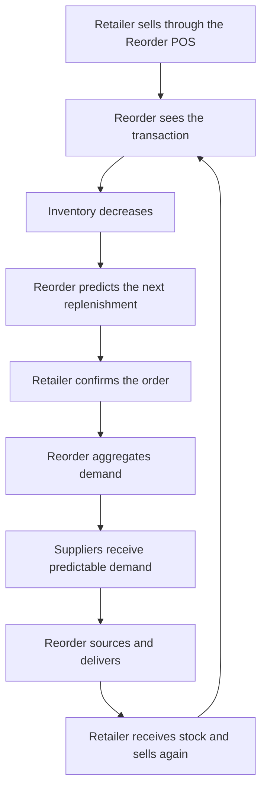

# 00 — Vision, Positioning and Narrative

Status: DRAFT v0.1 — adopted from the founder's idea document
Owner: Founder
Source narrative: [../MY_IDEA_REORDER.md](../MY_IDEA_REORDER.md) (33-section idea document)
Last updated: 2026-09-24

---

## 1. What this document is, and what it is not

This is the **narrative layer** of the pack: positioning, language, the flywheel and the moat. It
exists so that the founder's original idea document and this specification pack use the same words.

It is **not a specification**. Nothing here is a commitment to build, price or promise anything.
Where this document and a specification document disagree, the specification governs the build, and
the disagreement must be recorded in [13-open-decisions-and-assumptions.md](13-open-decisions-and-assumptions.md) §4.

| Topic | Governing document |
|---|---|
| Positioning, tagline, flywheel, moat | This document |
| Problem, vision, non-goals, market framing | [01-opportunity-and-vision.md](01-opportunity-and-vision.md) |
| Segments, personas, willingness to pay | [02-customers-and-segments.md](02-customers-and-segments.md) |
| Business model, pricing, unit economics, credit | [03-business-model-and-economics.md](03-business-model-and-economics.md) |
| Scope and the phase ladder | [04-product-scope-and-phasing.md](04-product-scope-and-phasing.md) |
| Functional requirements | [06-functional-requirements.md](06-functional-requirements.md) |
| Domain model, roles, authorisation | [07-domain-model-and-authz.md](07-domain-model-and-authz.md) |
| Supply network and fulfilment models | [09-supply-network-and-fulfillment.md](09-supply-network-and-fulfillment.md) |
| Legal, compliance and risk | [10-compliance-legal-and-risks.md](10-compliance-legal-and-risks.md) |
| Metrics | [11-validation-plan-and-metrics.md](11-validation-plan-and-metrics.md) |
| Phases and gates | [12-roadmap-and-gates.md](12-roadmap-and-gates.md) |
| Decisions and assumptions | [13-open-decisions-and-assumptions.md](13-open-decisions-and-assumptions.md) |

## 2. Naming and identity

| Item | Value |
|---|---|
| Product name | **Reorder** |
| Company | **Nexarch Technologies** |
| Category line | Intelligent Restocking Infrastructure for Retail Businesses |
| Geographic focus | Nigeria first, with expansion potential across Africa |
| Initial market | Pharmacies, supermarkets, malls, convenience stores, shops and informal retailers |

The category line replaces the earlier "(working name)" hedge used in the first draft of this pack.
The name is settled; the market definition is deliberately broad and is narrowed for launch by the
segments in [02](02-customers-and-segments.md) and decision D20 in [13](13-open-decisions-and-assumptions.md).

## 3. Positioning statement

> **Reorder is the intelligent restocking platform that connects retailers directly to the products
> they need, eliminating the time, cost and stress of routine market procurement.**

## 4. Short description

> **Reorder helps businesses restock without going to the market. Our software monitors retail sales
> and inventory, identifies products that need replenishment, and allows businesses to order directly
> from a connected supply network of manufacturers, importers, distributors and wholesalers. Reorder
> then coordinates fulfilment and delivery directly to the business.**

## 5. Informal-sector positioning

> **Run your shop with Reorder for free. Sell, track your stock and order what you need. When your
> products run out, we bring them to you.**

## 6. The fundamental idea

> **Don't send retailers to the market. Bring the market to the retailer.**

The technology makes that possible by connecting:

> **What was sold → what is running out → what needs to be purchased → where it can be sourced →
> how it gets delivered.**

The exchange stated in the idea document is the clearest single sentence available for investor and
customer conversations:

> **We give retailers the tools to know what they need. They give us the opportunity to supply what
> they need.**

## 7. Differentiation: ecommerce versus Reorder

| Ecommerce | Reorder |
|---|---|
| Customer wants something | Business sells something |
| Customer searches | System detects inventory falling |
| Customer purchases | System recommends replenishment |
| Fulfilment follows the order | Business confirms; Reorder sources and delivers |

> **Ecommerce responds to demand. Reorder anticipates and operationalises recurring business demand.**

This distinction is also the boundary that keeps Reorder out of the consumer marketplace business;
see the non-goals in [01](01-opportunity-and-vision.md) §8 and decision D19.

## 8. The flywheel

The operating loop:

The acquisition loop that feeds it:

> Free software → more retailers → more transaction data → better demand intelligence → more
> aggregated orders → better supplier economics → better prices and availability → more retailers.

**Design rule that keeps the flywheel honest:** every turn of the loop must produce a delivered,
settled order. Retailer count alone does not turn the wheel, and growth in sign-ups without repeat
orders is a stalled flywheel, not a spinning one.

## 9. The moat, mapped to when it is actually earned

The seven layers named in the idea document, with the phase in which each becomes real. The mapping
is the addition here: a moat claimed before its phase is a claim, not a defence.

| # | Moat layer | Earned in | Honest status today |
|---|---|---|---|
| 1 | Transaction data | P1 | Not started; depends on the POS sales feed existing |
| 2 | Demand intelligence | P1–P3 | Not started; depends on measured edit rates |
| 3 | Supplier network | P2 | Not started; the supply ladder in doc 09 is the path |
| 4 | Retail network | P2+ | Not started; the pilot cohort is the seed |
| 5 | Procurement economics | P3 | Depends on aggregation actually changing supplier prices (assumption A17) |
| 6 | Logistics network | P3+ | Deliberately deferred; route density comes first |
| 7 | Software lock-in | P1+ | Only if the restock list is used daily, measured by reorder rate |

## 10. Value propositions by audience

| Audience | Proposition |
|---|---|
| Retailer | Stop going to the market for routine restocking. Let Reorder bring the market to you. |
| Pharmacy | Know what is running out and replenish it without leaving your business. |
| Supermarket | Turn daily sales into tomorrow's procurement list. |
| Small shop | Get free tools to manage your shop and order your stock when it runs out. |
| Supplier | Access aggregated demand from retailers without individually acquiring every retailer. |
| Manufacturer | Reach a distributed network of retail outlets through one procurement platform. |

## 11. Statements in the narrative that are not yet commitments

Each of the following appears in the idea document as direction. It is kept here as direction, and
must not be quoted as a current capability or promise.

1. **Aggregated purchasing leverage.** Aggregation only moves supplier prices once demand is
   concentrated by category. At pilot scale it is unproven; see assumption A17 and
   [09](09-supply-network-and-fulfillment.md) §1.
2. **Supplier-facing data and placement services.** These are a genuine future revenue line, but
   they trade directly against retailer trust and must not precede the masking rules in
   [07](07-domain-model-and-authz.md) §5 and the risk R6 mitigation.
3. **Consumers in the long-term chain.** The long-term vision extends to consumers; the current
   non-goals exclude a consumer marketplace. This is decision D19.
4. **Category expansion beyond fast-moving consumables.** Electronics, building materials and
   restaurant supplies appear in the long-term list and are excluded from launch scope by D20.
5. **Regional distribution, cross-border commerce and financial products.** Phase 4 or beyond, and
   only after the gates in [12](12-roadmap-and-gates.md).

## 12. How to use this document

- **Investor or partner conversation:** use §3–§7 and §9, with §11 kept available for honest
  qualification of anything asked about scale.
- **Customer onboarding:** use the audience rows in §10 and the informal positioning in §5.
- **Product and engineering:** use the specification documents in the §1 table, not this one.
- **Any conflict with a specification document:** record it in
  [13](13-open-decisions-and-assumptions.md) §4 rather than silently preferring one.
