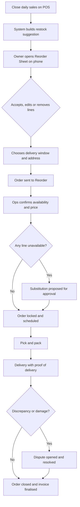
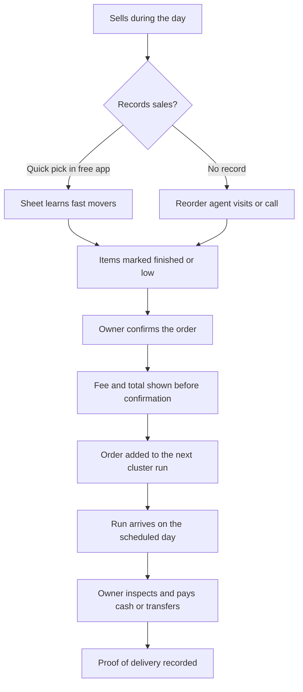

# 05 — User Journeys

Status: DRAFT v0.1
Owner: Product / Design
Depends on: [04-product-scope-and-phasing.md](04-product-scope-and-phasing.md)
Last updated: 2026-09-24

---

## How to read this document

Each journey lists the trigger, the steps, what the system does, and — most importantly — the
**failure points** and the **evidence to capture**. A journey without its failure points is a
demo script, not a design.

Phases referenced (P0–P4) are defined in [04-product-scope-and-phasing.md](04-product-scope-and-phasing.md).

---

## J1 — Formal retailer: daily close to delivered restock (P1+)

Actor: Ada (P1), community pharmacy owner.
Trigger: closing the day's sales.

| Step | Actor | Detail | System responsibility |
|---|---|---|---|
| 1 | POS | Daily sales close | Persist sales lines; never lose a sale to a sync failure |
| 2 | System | Suggest quantities per SKU | Use velocity, on-hand stock, lead time, pack size, shelf life, min/max rules |
| 3 | Owner | Review | Show a plain-language reason per line; allow edit, remove, add |
| 4 | Owner | Approve | Freeze a priced snapshot; record who approved and when |
| 5 | Ops | Confirm | Check stock with supplier; mark available, partial or unavailable |
| 6 | Owner | Approve substitutions | Default is **no substitution without explicit approval** |
| 7 | Pick/pack | Prepare the order | Packing list matched to order lines; capture batch/expiry where required |
| 8 | Rider | Deliver | Offline-capable proof of delivery: recipient, timestamp, photo/OTP, quantities |
| 9 | Owner | Accept | Confirm receipt, note shortages |
| 10 | Ops | Settle | Reconcile payment, close the order, update stock on hand |

**Failure points**

| # | Failure | Impact | Design response |
|---|---|---|---|
| F1 | Suggested quantity is obviously wrong | Owner stops trusting the Sheet permanently | Always show the reasoning; make the first versions conservative and editable; track edit rate |
| F2 | Supplier short of a line | Order arrives incomplete | Partial fulfilment requires the owner's decision; never silently substitute |
| F3 | Wrong pack size (ordered 6 pieces, got 6 cartons) | Financial damage and total loss of trust | Pack conversion is validated at order entry and again at pick |
| F4 | Short-dated stock delivered | Expiry loss, pharmacy refuses | Date check at pick; minimum remaining shelf life per category |
| F5 | Rider arrives with no notice | Order refused, wasted trip | Delivery window confirmed by the owner; notification before arrival |
| F6 | Price differs from the approved snapshot | Dispute | Price snapshot is immutable once approved; changes need re-approval |
| F7 | Owner is offline when the order needs approval | Delay | Queue the order; allow approval by reply to a notification |

**Evidence to capture:** suggestion-to-accepted ratio per line, edit reasons, time from close to
approval, availability rate per supplier, discrepancy rate, days-to-repeat.

---

## J2 — Informal retailer: from sales log to delivered top-up (P1–P4)

Actor: Musa (P3), kiosk operator.
Trigger: an item finishes, or a scheduled ordering day arrives.

**Key design constraint:** the kiosk operator must be able to complete an order in **under 60
seconds** and without typing a product name. If that is not possible, an agent does it for them,
and the agent cost is priced into the run.

**Failure points**

| # | Failure | Impact | Design response |
|---|---|---|---|
| F1 | No data on what finished | Suggestion is useless | Default to a "usual basket" per kiosk, learned from previous orders |
| F2 | Order value below the zone minimum | The drop loses money | Enforce a minimum order value per zone; below it, top up to the minimum or wait for the next run |
| F3 | Owner has no cash on the delivery day | Order refused; lost trip | Offer transfer-to-virtual-account before dispatch; hold the order to the next run |
| F4 | Kiosk is closed when the rider arrives | Wasted drop | Notify the day before; require a confirmation reply before dispatch |
| F5 | Rider disappears with cash | Loss and dispute | Rider float limits, daily reconciliation, transfer-first default, deposit/guarantor |
| F6 | Owner expects same-day delivery | Broken expectation | Publish the run schedule per cluster at signup; the promise is the schedule, not on-demand |

**Evidence to capture:** order value distribution, share of orders placed without agent help,
confirmation rate before dispatch, cash-on-delivery failure rate, drops per run, cost per drop.

---

## J3 — Reorder agent: running a cluster (P2+)

Actor: Tunde (P5).
Trigger: the run day starts.

| Step | Action | Offline behaviour |
|---|---|---|
| 1 | Open today's run: ordered drops, addresses, order values, payment expectation | Cached at run start |
| 2 | For each drop: navigate, deliver, capture signature/OTP/photo, capture cash | Fully offline-capable |
| 3 | Handle a refusal: mark reason, keep goods, move to next drop | Cached; synced later |
| 4 | Upsell capture: log what the shopkeeper asked for that was not on the run | Cached |
| 5 | End of run: return unsold stock, reconcile cash against the manifest | Requires connectivity; blocks run closure until it balances |

**Non-negotiable:** a run cannot be closed with unexplained cash. The tool must show expected
cash, counted cash, and force a reason for every variance.

---

## J4 — Supplier: confirming and fulfilling (P2+)

Actor: Chidi (P6), importer/wholesaler.

| Step | Mode A — Supplier delivers | Mode B — Reorder picks up | Mode C — Reorder stocks |
|---|---|---|---|
| Receives demand | Order passed to supplier, branded by Reorder | Reorder collects at the supplier | Not applicable |
| Confirms availability | Supplier confirms or substitutes in the portal | Reorder ops confirms by call, records in the portal | Fulfilled from stock |
| Fulfils | Supplier's van delivers | Reorder van collects and delivers | Reorder picks |
| Invoices | Supplier invoices Reorder or the retailer per agreement | Reorder collects; supplier invoices Reorder | Reorder invoices retailer |
| Settlement | Per agreed term | Delivery fee and commission retained | Goods margin retained |

Supplier's main fear is disintermediation. The portal must not expose the retailer's contact
details unless the retailer consents. This is a **product-level privacy requirement**, not a
policy note.

---

## J5 — Discrepancy, return and claim (P2+)

Trigger: delivered quantity, price, quality, or dating differs from the approved order.

| Step | Actor | Rule |
|---|---|---|
| 1 | Retailer flags the discrepancy at delivery | Rider must be able to record it offline at the doorstep |
| 2 | Reorder classifies | Shortage, damage, wrong item, expired/short-dated, price mismatch |
| 3 | Resolution path | Credit note, replacement on the next run, or return of goods |
| 4 | Supplier recovery | If supplier-caused, Reorder raises a claim; the policy must be agreed **before** onboarding |
| 5 | Ledger update | Credit notes post to the account ledger, never just to the order |

**Rule:** every claim must have a photo and a quantity, or it is not a claim. This one rule
prevents most informal-trade disputes.

---

## J6 — Onboarding a business (P0–P2)

| Stage | Formal (S1) | Informal (S2) |
|---|---|---|
| Discovery | Direct visit or referral; POS-led conversation | Cluster walk with the agent; community introduction |
| Minimum data captured | Business name, address, phone, owners/approvers, branches, categories, supplier list, delivery window | Name, kiosk location, photo, phone, usual basket, preferred run day |
| Identity | Business registration and owner ID | Owner ID and kiosk verification photo/location |
| Catalog | Import from POS or supplier price lists | Default catalog per cluster, learned from prior orders |
| First order | Assisted walkthrough of the Sheet | Agent places the first order with the owner present |
| Activation test | Second order within 21 days | Second order within 14 days |

**Onboarding rule:** no account is created without a named owner and a verified location. Location
and cluster assignment are prerequisites for delivery economics.

---

## J7 — Credit qualification (P4 only)

Trigger: an account with a clean order history asks for float.

1. System computes eligibility from order history, payment punctuality, order value and cluster
   history — **server-side only; the retailer never self-declares a limit**.
2. Ops reviews for exceptions and identity gaps.
3. Limit is assigned per account, with an expiry date and automatic re-review.
4. Every order checks the limit at approval time, not at submission time.
5. Ageing, dunning and freeze events are recorded on the ledger with reasons.

Do not build this before phase 4. Do design the ledger so it is possible.
