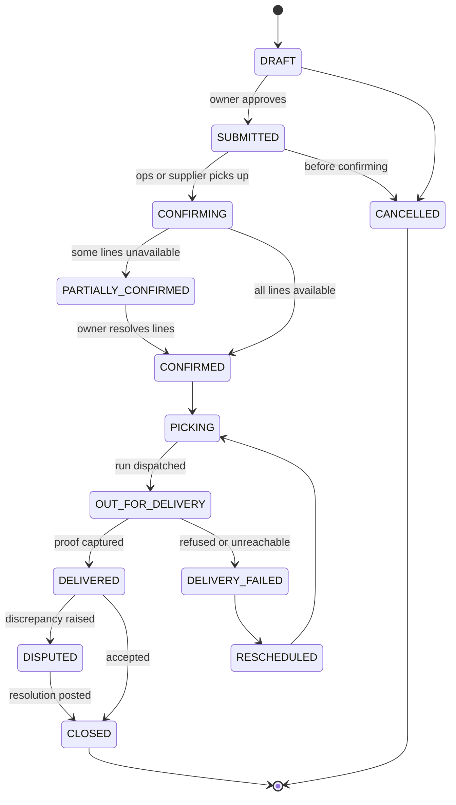

# 07 — Domain Model and Authorisation

Status: DRAFT v0.1
Owner: Engineering
Depends on: [06-functional-requirements.md](06-functional-requirements.md)
Last updated: 2026-09-24

---

## 1. Entities

Names are working names. They exist so that documents, requirements and code use one vocabulary.

### Tenancy and identity

| Entity | Purpose | Key fields |
|---|---|---|
| `Business` | The tenant. A retailer, supplier or Reorder-operated entity | id, type (RETAIL \| SUPPLIER \| INTERNAL), name, status, registration refs, primary location |
| `BusinessUser` | A person with access to a business | id, businessId, userId, role, status, branchScope |
| `User` | Authenticated identity | id, phone (primary), email, name, verifiedAt |
| `Branch` / `Site` | Physical location of a business | id, businessId, address, geo, deliveryWindow, zoneId, status |
| `Consent` | Records what a business agreed to share | id, subjectBusinessId, counterpartyId, scope, grantedAt, revokedAt |

### Catalog and supply

| Entity | Purpose | Key fields |
|---|---|---|
| `Product` | Catalog master | id, name, brand, category, baseUnit, status, flags (batchTracked, expiryTracked, coldChain, regulated) |
| `Barcode` | Identifier(s) per product | productId, code, type (EAN \| internal \| supplier) |
| `PackDefinition` | Conversion between units | productId, unit, factorToBase, isPurchasingUnit, isSellingUnit |
| `SupplierOffer` | A supplier's price and terms for a product | supplierId, productId, packUnit, price, currency, moq, leadTimeDays, effectiveFrom, effectiveTo |
| `PriceListVersion` | Immutable version of a supplier's submitted price list | supplierId, version, source, uploadedAt, approvedBy, status |
| `SupplierTerms` | Commercial terms | supplierId, paymentTerm, returnPolicy, minShelfLifePct, deliveryMode |
| `Zone` | Delivery geographic unit | id, name, boundary/geohash list, deliveryDays, minOrderValue, deliveryFee |
| `Cluster` | A group of informal sites inside a zone | id, zoneId, agentId, sites[], runDay |

### Demand capture

| Entity | Purpose | Key fields |
|---|---|---|
| `StockSnapshot` | Stock on hand for a product at a site at a time | siteId, productId, quantityBase, source (count \| pos \| derived), capturedAt, capturedBy |
| `SalesLine` | A sale recorded (from POS or manual) | siteId, productId, quantityBase, unitPrice, soldAt, source |
| `StockAdjustment` | Correction with reason | siteId, productId, delta, reasonCode, actorId, note, at |
| `BatchLot` | Batch/expiry for tracked products | siteId, productId, batchNo, expiryDate, quantityBase, supplierId |

### Replenishment and ordering

| Entity | Purpose | Key fields |
|---|---|---|
| `ReorderSuggestion` | Generated line | siteId, productId, suggestedQtyBase, reason, inputs (velocity, onHand, leadTime), generatedAt, engineVersion |
| `ReorderSheet` | The set of suggestions presented to the owner for a site | id, siteId, generatedAt, status, approvedAt, approvedBy |
| `Order` | An accepted purchasing intent | id, businessId, siteId, deliveryWindow, status, currency, totalsSnapshot, approvedBy, approvedAt, source |
| `OrderLine` | A line on the order | orderId, productId, requestedQtyBase, packUnit, unitPrice, priceSource, status, substitutionOf, rejectionReason |
| `Substitution` | Proposed replacement | orderLineId, proposedProductId, reason, approvedBy, approvedAt, status |
| `OrderEvent` | Append-only lifecycle record | orderId, type, actorId, at, payload, reason |

### Fulfilment

| Entity | Purpose | Key fields |
|---|---|---|
| `Run` | A scheduled delivery trip | id, zoneId, date, vehicle, riderId, status, plannedDrops, actualDrops |
| `Drop` | One order's delivery within a run | runId, orderId, sequence, plannedAt, status |
| `PickList` | Warehouse/handling instruction per run | runId, lines[], pickedBy, packedAt |
| `DeliveryProof` | Evidence of delivery | dropId, recipientName, otp, signatureRef, photoRef, geo, at, offlineRecorded |
| `Discrepancy` | A mismatch at delivery | dropId, type, orderLineId, reportedQty, photoRef, status, resolution |
| `ReturnRecord` | Goods returned to stock or to supplier | dropId, productId, quantityBase, disposition, approvedBy |

### Money

| Entity | Purpose | Key fields |
|---|---|---|
| `LedgerAccount` | One per business and one internal per supplier-float obligation | id, ownerType, ownerId, currency, balance |
| `LedgerEntry` | Append-only financial entry | accountId, type, amount, currency, refType, refId, at, actorId |
| `Payment` | A collection | id, businessId, orderId, method, amount, currency, status, reference, receivedAt |
| `Invoice` | What the business owes or has paid for | id, businessId, orderId, lines[], total, status, dueAt |
| `CreditFacility` | Assigned credit limit | businessId, limitAmount, currency, status, assignedBy, reviewedAt, expiresAt |
| `SupplierRemittance` | Funds held on behalf of a supplier | supplierId, period, grossAmount, commission, netPayable, status, paidAt |

### Platform

| Entity | Purpose | Key fields |
|---|---|---|
| `Notification` | Outbound message record | channel, template, recipient, refType, refId, status, sentAt |
| `AuditLog` | Who changed what | actorId, businessId, entity, entityId, action, before, after, at |
| `OutboxEvent` | Reliable async dispatch | topic, payload, status, attempts, nextAttemptAt |

## 2. Pack conversion rules

Pack conversion is where most goods-trade software fails. The rules must be explicit:

1. Every product has exactly one **base unit** (usually the piece). All stock and sales quantities
   are stored in base units.
2. Purchasing units (pack, carton, case) are **conversions to base**, never a separate stock pool.
3. Conversion factors are per supplier where suppliers differ (a carton of 24 from one importer may
   be a carton of 12 from another).
4. Order quantity is always expressed to the user in the purchasing unit they chose, and stored in
   base units, with both retained on the order line for audit.
5. Rounding always goes up to the nearest purchasable unit, and the sheet must tell the owner that
   it did so.
6. A change to a conversion factor never retroactively alters a historical order line.

## 3. Order lifecycle

Rules:

- `DRAFT` is the only state where the owner can freely change lines with no approval trail.
- Once `CONFIRMED`, price totals are frozen; adding goods creates a new amendment event.
- `PICKING` blocks owner-side cancellation; it requires ops approval.
- `CLOSED` is reachable only when payment status is resolved or explicitly recorded as receivable.
- Every transition writes an `OrderEvent`. There is no silent state change.

## 4. Role and permission matrix

Legend: `F` full, `R` read, `C` create, `U` update own-in-scope, `—` none.

| Capability | OWNER | MANAGER | ATTENDANT | AGENT | PICKER | RIDER | SUPPLIER_USER | OPS | ADMIN |
|---|---|---|---|---|---|---|---|---|---|
| View business orders | F | F | R | R (assigned) | R (assigned) | R (assigned) | R (own lines) | F | F |
| Approve order | F | F | — | C (on behalf) | — | — | — | — | — |
| Edit catalog | F | U | — | — | — | — | — | F | F |
| Manage users | F | — | — | — | — | — | — | F | F |
| Capture stock/sales | F | F | C | C | — | — | — | F | F |
| View prices from all suppliers | F | F | — | R | R | — | own only | F | F |
| Assign credit limit | — | — | — | — | — | — | — | C | F |
| Close a run | — | — | — | — | C | C | — | F | F |
| View supplier identity | F | F | — | R | R | — | own | F | F |
| View retailer identity | n/a | n/a | n/a | F | R | R | masked | F | F |

## 5. Authorisation and tenancy rules

1. **Server-derived context.** The active business, role, branch scope and permissions are resolved
   from the authenticated session on every request. A `businessId` in a request body or query
   string is treated as a selector that must be validated against the session, never as an
   authority.
2. **Central enforcement.** Tenant scoping is applied by shared data-access infrastructure so a new
   handler cannot forget it. Handler-level checks alone are insufficient.
3. **Server-computed money and limits.** Prices, delivery fees, order totals and credit limits are
   computed server-side. Client-provided values are rejected, not reconciled.
4. **Approval identity.** An order approval records the authenticated user, the role at the time,
   and whether it was made on behalf of the owner (agent-assisted).
5. **Masking on the supply side.** Supplier users do not see retailer contact details unless a
   `Consent` record exists for that counterparty pair.
6. **Cross-tenant references** (for example an order that references a supplier product) are
   validated by ownership before use; an ID from another tenant is never sufficient to read data.

## 6. Audit and immutability

| Rule | Applies to |
|---|---|
| Append-only, no deletes | `LedgerEntry`, `OrderEvent`, `AuditLog`, `Payment` |
| Void with reason, never edit | `Invoice`, `OrderLine` amounts after approval |
| Versioned, historical orders protected | `SupplierOffer`, `PriceListVersion`, `PackDefinition` |
| Before/after captured | Prices, quantities, roles, permissions, credit limits, pack conversions |

## 7. Data retention and privacy

- Personal data (names, phone numbers, ID references, delivery photos) is minimised at capture and
  access-controlled by role.
- Delivery photos are retained for a defined dispute window, then purged; the record of delivery
  itself is retained longer for financial audit.
- Location data is used for delivery and fraud checks; retention policy must be written down before
  the pilot scales. This connects to the Nigerian data protection position in
  [10-compliance-legal-and-risks.md](10-compliance-legal-and-risks.md).
